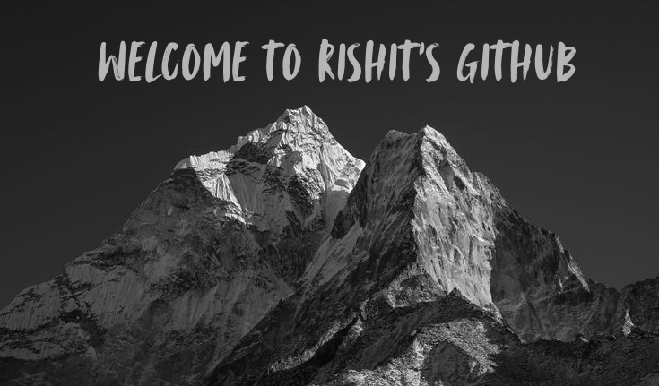

  

 

<h2 align="center">  <em>About  me </em></h2>

 

  Hello There! <em><b> I'm Rishit </b></em>, a Computer Science student. I enjoy learning new technologies and problem solving at Codeforces and Codechef. Now I'm working at some little and fun projects to put in practice my knowledge about Python, Javascript and more.

 

   <em><b> Studying at the National Forensic Sciences University, India </b></em>  
   <em><b> Valorant Player  </b></em> 

 
 
<h2 align="center">  <em> Technologies </em> </h2>

  
  
  
  
  

 

 

